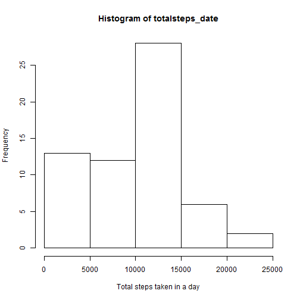
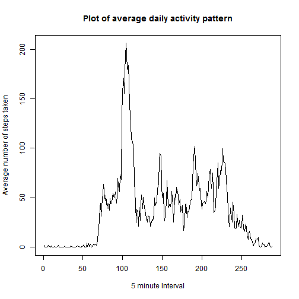
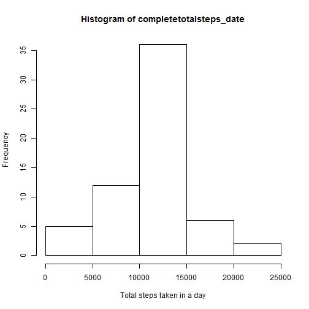
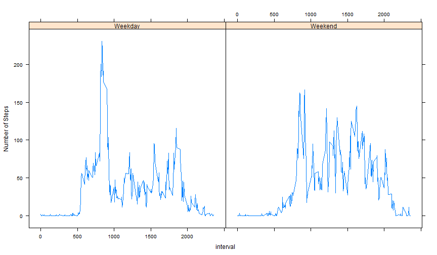

This document will walkthrough the Reproducible Research Course Project 1.

## Part 1
### Loading and preprocessing the data

The first step is to prepare the data, with the first step loading it. We assume the zip file has been extracted in your R Working directory, and so the data is in the folder "repdata-data-activity". We read in the data and use summary to check it has been read corectly.


```r
dataset_1 <- read.csv("repdata-data-activity/activity.csv")
summary(dataset_1)
```

```
##      steps                date          interval     
##  Min.   :  0.00   2012-10-01:  288   Min.   :   0.0  
##  1st Qu.:  0.00   2012-10-02:  288   1st Qu.: 588.8  
##  Median :  0.00   2012-10-03:  288   Median :1177.5  
##  Mean   : 37.38   2012-10-04:  288   Mean   :1177.5  
##  3rd Qu.: 12.00   2012-10-05:  288   3rd Qu.:1766.2  
##  Max.   :806.00   2012-10-06:  288   Max.   :2355.0  
##  NA's   :2304     (Other)   :15840
```

We see that the 'interval' variable has been read in as integer values. We really want to set this as a factor variable, as each interval value identifies a specific time of day, the same for each day.


```r
dataset_1$interval <- as.factor(dataset_1$interval)
```

Now our data set is ready to be analysed.


## Part 2
### What is mean number of steps taken each day?

First we need to calculate the number of steps taken each day.

To do this, we need to be able to look at each day separately. We can generate this by using 'split' to separate the data by the date, which is a factor variable.


```r
dataset_bydate <- split(dataset_1,dataset_1$date)
```

We can then using sapply to sum the steps for each one. We have a list of tables, and so we need to define a function in sapply that sums a specific columns in each table. We also want to ignore NA values at this point.


```r
totalsteps_date <- sapply(dataset_bydate, function(x) sum(x$steps, na.rm = TRUE))
```

We now have a vector which shows the total number of steps taken for each day. We can plot this in a histogram.


```r
hist(totalsteps_date, xlab = "Total steps taken in a day")
```

 

Next, we want to know the mean and median of the total number of steps taken per day. First the mean

```r
mean(totalsteps_date)
```

```
## [1] 9354.23
```

then the median

```r
median(totalsteps_date)
```

```
## [1] 10395
```

This shows us the median value is slightly above the mean, but both are around 10,000. This looks sensible based on our histogram.

## Part 3
### What is the average daily activity pattern?

We can calculate the average number of steps in a similar manner as we addressed part 2. Instead of splitting by the date factor, we can split by the interval factor (see the introduction). Then, instead of using a sum-type function in sapply, we can use a function that takes the average (which we will define here as the mean). Again, we are ignoring NA values.


```r
dataset_byinterval <- split(dataset_1, dataset_1$interval)
averagesteps_interval <- sapply(dataset_byinterval, function(x) mean(x$steps,na.rm = TRUE))
```

This gives us an output vector of the average number of steps for each of the five minute intervals. Note that the 'names' of the intervals are defined as the number identifying them, and are included as the names of our output vector.


```r
head(averagesteps_interval)
```

```
##         0         5        10        15        20        25 
## 1.7169811 0.3396226 0.1320755 0.1509434 0.0754717 2.0943396
```

Now we can create a plot showing the average number of steps against the interval. We can add some labels to make it look better. As the interval names represent values on the 24 clock (e.g. 500 is 05:00, 2235 is 22:35), they are not continous (there is no 575 for example). Instead, if we simply plot our vector our x-axis will be the index for each 5 minute interval.


```r
plot(averagesteps_interval,type = "l",xlab = "",ylab = "")
title("Plot of average daily activity pattern",xlab="5 minute Interval", ylab = "Average number of steps taken")
```

 

From our plot, it looks like the maximum is somewhere around 200 steps, around interval 100. We can check the actual maximum value:


```r
max(averagesteps_interval)
```

```
## [1] 206.1698
```

We can check the index of this:


```r
which.max(averagesteps_interval)
```

```
## 835 
## 104
```

This shows us the maximum is the 104th interval, which corresponds to 835, or 8.35AM.

## Part 4
### Imputing missing values

Up till now, we have ignored missing values, effectively treating them as zero. Obviously this isn't always going to be correct. Their are days with all NA values, and it is unlikely there were no steps that day.

The first thing we can do is to calculate how many values are missing. We generate a vector of the indices of the missing values by combining the is.na() and which() functions/ Applying is.na to the steps column of our overall data set will return a vector the length of the data set, with vlues TRUE if NA and FALSE if there is a value present. Feeding this vectot into which() will return a vector of the indices where the value was TRUE, so values were missing. The length of this vector will tell us how many missing values we have.


```r
missing_values <- which(is.na(dataset_1$steps))
length(missing_values)
```

```
## [1] 2304
```

If we want to fill in mising values, we can calculate them based on the values we already have. We cannot effectively use the average for that day to fill missing values, as there are whole days of missing values. We therefore can use the average for that five minute interval across all days, which we have already calculated. Note, this will not be an exact number of steps, which is okay for our simple solution.

To do this, we need create a new dataset initially identical to the first. We can then look down the list of missing values, check which interval it is (column 3), get the average for that interval , and apply it (to column 1). We can re-check the head of the data to see if the values have been entered (as the first day had missing values).


```r
dataset_2 <- dataset_1

for(i in 1:length(missing_values)){
     row_change <- missing_values[i]
     interval_check <- dataset_2[row_change,3]
     average_val <- averagesteps_interval[interval_check]
     dataset_2[row_change,1] <- average_val
}
head(dataset_2)
```

```
##       steps       date interval
## 1 1.7169811 2012-10-01        0
## 2 0.3396226 2012-10-01        5
## 3 0.1320755 2012-10-01       10
## 4 0.1509434 2012-10-01       15
## 5 0.0754717 2012-10-01       20
## 6 2.0943396 2012-10-01       25
```

We can now repeat the steps in Part 2 to get our histogram.


```r
newdataset_bydate <- split(dataset_2,dataset_2$date)

completetotalsteps_date <- sapply(newdataset_bydate, function(x) sum(x$steps, na.rm = TRUE))

hist(completetotalsteps_date, xlab = "Total steps taken in a day")
```

 

We can already see this looks a little different from our first histogram. To check the changes we can look at the mean and median for our new det.

```r
mean(completetotalsteps_date)
```

```
## [1] 10766.19
```

```r
median(completetotalsteps_date)
```

```
## [1] 10766.19
```

We can see now that the mean and median have changed. They are now the same, which is probably linked to the fact that we have introduced values based on the average. We also see that introducing missing values increases the average (as you might expect).

## Part 5
### Are there differences in activity patterns between weekdays and weekends?

First, we need to update our filled in data set to show which day it is. We can do this using the weekdays() function, feeding in the date. However, we need to change to a Date type variable for this to work, using as.Date. We already have the default format of the text. We can then convert the day of the week to either weekday or weekend.


```r
date_vector <- as.Date(dataset_2$date)
days_vector <- weekdays(date_vector)

for(i in 1:length(days_vector)){
     if(days_vector[i]=="Saturday"|days_vector[i]=="Sunday"){
          days_vector[i] <- "Weekend"
     } else{
          days_vector[i] <- "Weekday"
     }
}

dataset_2$weekday <- as.factor(days_vector)
```

We know have a new column with whether it is a weekday or weekend. To get the activity pattern, we can repeat Part 3 for two subsets of our data. First, the subset for weekdays. A simple way to do this is to choose those which aren't Saturday or Sunday.

We can subset this to get the activity pattern for exh level, in a similar way to part 3.


```r
weekday_data <- dataset_2[dataset_2$weekday=="Weekday",]
weekend_data <- dataset_2[dataset_2$weekday=="Weekend",]

weekdayset_byinterval <- split(weekday_data, weekday_data$interval)
weekday_interval <- sapply(weekdayset_byinterval, function(x) mean(x$steps))

weekendset_byinterval <- split(weekend_data, weekend_data$interval)
weekend_interval <- sapply(weekendset_byinterval, function(x) mean(x$steps))
```

We now have vectors showing the activity pattern for weekdays and the weekend. To create a panel plot, first we want to make sure we have the correct package loaded.


```r
library(lattice)
```

We can combine the two patterns into a frame to help create our panel plot.


```r
weekendframe <- data.frame(interval=names(weekend_interval),averagesteps=weekend_interval,daytype=rep("Weekend",times=length(weekend_interval)))

weekdayframe <- data.frame(interval=names(weekday_interval),averagesteps=weekday_interval,daytype=rep("Weekday",times=length(weekday_interval)))

lattice_frame <- rbind(weekdayframe,weekendframe)

lattice_frame$interval <- as.numeric(as.character(lattice_frame$interval))

xyplot(averagesteps~interval|daytype,data=lattice_frame,type="l",ylab = "Number of Steps")
```

 

This shows that there are differences between weekdays and weekends. The subject does more walking on weekday mornings, and slightly more on weekend lunchtimes and afternoon.

As a final note, for this plot we have used the interval values on the x-axis. The data is therefore not continous (e.g. it represents the 24 hour clock, and so there is no 60-95, 160-195 etc.)


